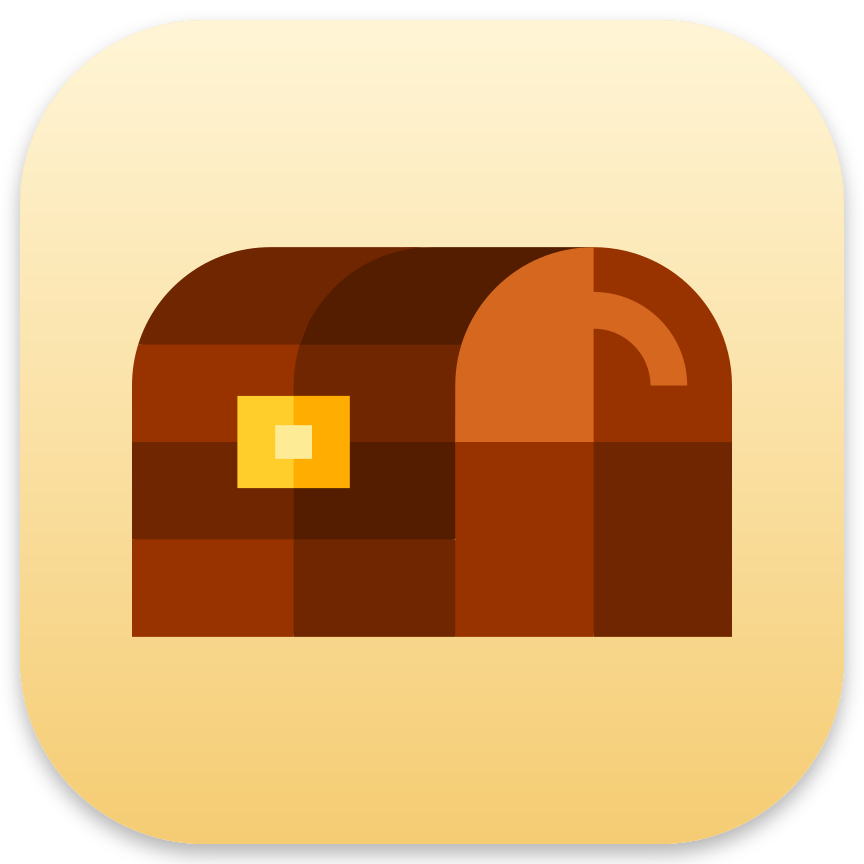

<p align="center">
  
</p>

# Chest

Chest tucks menu bar items away on macOS 27. Hold ⌘ and drag an item left of Chest's dot to hide it there, or onto the chest that appears under the dot to put it in the drawer. Click the dot to bring the hidden items back and open the drawer; click an item there to use it.

It is a small, open-source alternative to [Ice](https://github.com/jordanbaird/Ice) for macOS 27 (Golden Gate), where the trick Ice relied on no longer works.

## Using it

| Do this | And |
|---|---|
| ⌘-drag a menu bar item | A chest hangs under the dot while you drag. |
| …and drop it on the chest | It goes into the drawer. The dot turns into a box while you are over the chest. |
| …and leave it left of the dot | It is hidden there, and comes back in the same place while Chest is open. |
| ⌘-drag a hidden item right of the dot (while Chest is open) | It stays in the menu bar for good. |
| Click the dot | The hidden items come back left of it, the drawer opens under it, and the dot becomes a ring. |
| Click an item in the drawer | Its menu opens right under it; the item itself stays out of the menu bar. An item with a popover instead of a menu opens it where the item last was. |
| Drag an item out of the drawer to the menu bar | It goes back there, where a marker shows: left of the dot it is hidden there, right of it it stays. |
| Right-click an item in the drawer | **Remove from Chest** puts it back in the menu bar for good. |
| Click elsewhere, click the dot again, or press Esc | Chest closes: the drawer goes and the hidden items go back once their menus close. |
| Right-click the dot | Open at Login, Permissions, About, Quit. |

Quitting Chest puts every item back in the menu bar; the next launch tucks them away again.

## What makes it different

On macOS 27 other menu bar managers hide items with the menu bar part of exam mode (assessment mode). That also hides Focus and Control Center's camera and microphone indicator, hides every app that does not run from `/Applications`, and stops the clock from opening Notification Center.

Chest uses macOS's own switches instead: the ones under **System Settings › Menu Bar › Allow in the Menu Bar**, plus Spotlight's own checkbox. None of that happens:

- The camera, microphone and Focus indicators stay where they are.
- The clock still opens Notification Center.
- Apps outside `/Applications` are not affected.

See [docs/APPROACH.md](docs/APPROACH.md) for how it works and what was ruled out.

## Requirements

- macOS 27 or later.
- **Accessibility**, to see where items are in the menu bar and to open them from the drawer.
- **Full Disk Access**, because macOS keeps the "Allow in the Menu Bar" list in a protected place. After you switch it on, macOS asks to quit and reopen Chest; choose **Quit & Reopen**.

Chest asks for both on first launch and shows their status. It makes no network connections.

## Install

With [Homebrew](https://brew.sh); this repository is its own tap:

```sh
brew tap boringbar/chest https://github.com/boringbar/chest
brew install --cask chest
```

Chest updates itself, so `brew upgrade` leaves it alone. `brew uninstall --cask chest` quits it first, which puts every item back in the menu bar; add `--zap` to remove its settings too.

Or run it from source: see [Develop](#develop).

## Develop

Everything builds with SwiftPM; there is no Xcode project.

```sh
swift build
swift test         # the allow list format and the menu bar geometry
swift run          # runs Chest from the terminal; Ctrl-C quits it cleanly and restores items
```

`swift run` works because the build embeds `Resources/Info.plist` in the binary. Permissions belong to the program that holds them, though, so for `swift run` grant them to your terminal app.

Debug builds log to stderr with a `[Chest]` prefix.

## Limits

- Hiding is per app: an app with two menu bar items hides both.
- macOS lists an app under "Allow in the Menu Bar" by itself, usually as soon as its item appears. Until it does, the app cannot go into the chest; Chest says so and offers **Refresh Menu Bar**, which restarts the menu bar so macOS lists it (the menu bar blinks once).
- Of the items under **Menu Bar Controls**, only Spotlight can go in so far. The others (Wi-Fi, Sound, …) each need their switch mapped; see the approach doc.
- If Chest is force quit or crashes, the items stay hidden until it runs again, or until you switch them back on in System Settings › Menu Bar.
- Items that do not fit in the menu bar are collapsed by macOS behind its own `«` button, on any Mac (sooner on one with a notch). That includes items hidden left of the dot when Chest opens: keep a few there and the rest in the drawer, which wraps into rows of ten and has room for any number.
- The list and its format are undocumented and may change in a macOS update.

## License

MIT. See [LICENSE](LICENSE).
